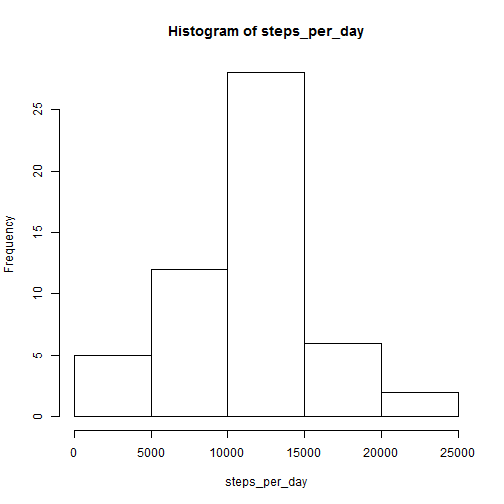
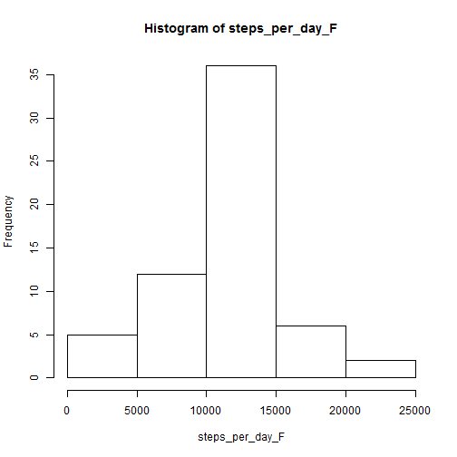
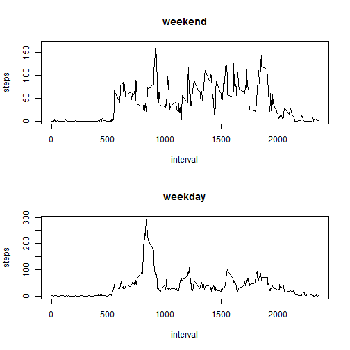

github repo link :https://github.com/gatenio/RepData_PeerAssessment1.git 
---
Loading and preprocessing the data:

Q1.Loading and preprocessing the data
---

Process/transform the data (if necessary) into a format suitable for my analysis:

---

```r
setwd("C:/Users/user/Desktop/Git/GitHub/RepData_PeerAssessment1")
getwd()
```

```
## [1] "C:/Users/user/Desktop/Git/GitHub/RepData_PeerAssessment1"
```

```r
activity <- read.csv("activity.csv")
names(activity)
```

```
## [1] "steps"    "date"     "interval"
```

```r
head(activity)
```

```
##   steps     date interval
## 1    NA 01-10-12        0
## 2    NA 01-10-12        5
## 3    NA 01-10-12       10
## 4    NA 01-10-12       15
## 5    NA 01-10-12       20
## 6    NA 01-10-12       25
```
---

Q2. What is the mean total number of steps taken per day?
---

2.1 Make a histogram of the total number of steps taken each day:

2.1.1 summing steps/day

---

```r
steps_per_day <- aggregate(steps ~ date, activity, sum)$steps
```
---

2.1.2 plot hist(steps_per_day$steps)

---

```r
hist(steps_per_day)
```

 
---

2.2.Calculate and report the mean and median total number of steps taken per day

---


```r
mean(steps_per_day)
```

```
## [1] 10766
```

```r
median(steps_per_day)
```

```
## [1] 10765
```
---

Q3. What is the average daily activity pattern?
---

3.1 Make a time series plot (i.e. type = "l") of the 5-minute interval (x-axis) and the average number of steps taken, averaged across all days (y-axis)

---

```r
steps_interval <- aggregate(steps ~ interval, data = activity, mean)
plot(steps_interval, type = "l")
```

 
---

3.2 Which 5-minute interval, on average across all the days in the dataset, contains the maximum number of steps?

---

```r
maxInterval = which.max(steps_interval$steps)
maxInterval
```

```
## [1] 104
```
---

Q4. Imputing missing values
---

4.1 Calculate and report the total number of missing values in the dataset (i.e. the total number of rows with NAs)

---

```r
head(activity)
```

```
##   steps     date interval
## 1    NA 01-10-12        0
## 2    NA 01-10-12        5
## 3    NA 01-10-12       10
## 4    NA 01-10-12       15
## 5    NA 01-10-12       20
## 6    NA 01-10-12       25
```

```r
a=is.na(activity)
head(a)
```

```
##      steps  date interval
## [1,]  TRUE FALSE    FALSE
## [2,]  TRUE FALSE    FALSE
## [3,]  TRUE FALSE    FALSE
## [4,]  TRUE FALSE    FALSE
## [5,]  TRUE FALSE    FALSE
## [6,]  TRUE FALSE    FALSE
```

```r
sum(a)
```

```
## [1] 2304
```
---

4.2 Devise a strategy for filling in all of the missing values in the dataset. The strategy does not need to be sophisticated. For example, you could use the mean/median for that day, or the mean for that 5-minute interval, etc.

---

Strategy- using the means of 5-minute intervals as fillers:
Create a new dataset-activityF, that is equal to the original dataset but with the missing data filled in.

---

```r
activityF <- merge(activity, steps_interval, by = "interval", suffixes = c("", 
    ".y"))
nas <- is.na(activityF$steps)
activityF$steps[nas] <- activityF$steps.y[nas]
activityF <- activityF[, c(1:3)]
head(activity)
```

```
##   steps     date interval
## 1    NA 01-10-12        0
## 2    NA 01-10-12        5
## 3    NA 01-10-12       10
## 4    NA 01-10-12       15
## 5    NA 01-10-12       20
## 6    NA 01-10-12       25
```

```r
head(activityF)
```

```
##   interval steps     date
## 1        0 1.717 01-10-12
## 2        0 0.000 23-11-12
## 3        0 0.000 28-10-12
## 4        0 0.000 06-11-12
## 5        0 0.000 24-11-12
## 6        0 0.000 15-11-12
```
---

4.3 Make a histogram of the total number of steps taken each day and Calculate and report the mean and median total number of steps taken per day.
Do these values differ from the estimates from the first part of the assignment? 
What is the impact of imputing missing data on the estimates of the total daily number of steps?

---

4.3.1 Plot new histogram

---

```r
steps_per_day_F <- aggregate(steps ~ date, activityF, sum)$steps
hist(steps_per_day_F)
```

 
---

4.3.2 Recaculate mean step/day

---

4.3.3 Recalculate new median 

---

```r
mean(steps_per_day_F)
```

```
## [1] 10766
```

```r
median(steps_per_day_F)
```

```
## [1] 10766
```
---

4.3.4 This filling strategy present minor changes in the mean and median steps/day results.

---

Q.5 Are there differences in activity patterns between weekdays and weekends?
---

5.1 Create a new factor variable in the dataset with two levels – “weekday” and “weekend”
indicating whether a given date is a weekday or weekend day.

5.2 Make a panel plot containing a time series plot (i.e. type = "l") of the 5-minute interval (x-axis) and the average number of steps taken, averaged across all weekday days or weekend days (y-axis). The plot should look something like the following, which was creating using simulated data:
Your plot will look different from the one above because you will be using the activity monitor data. Note that the above plot was made using the lattice system but you can make the same version of the plot using any plotting system you choose.

---

Define day_type function-weekday or weekend day types : 
create new dataset named activity_DT:

Define subset for each type. weekend and weekday types
Plot panel plot contain each day type :

---

```r
day_type <- function(date) {
    if (weekdays(as.Date(date)) %in% c("Saturday", "Sunday")) {
        "weekend"
    } else {
        "weekday"
    }
}
activity_DT=activity
activity_DT$day_type <- as.factor(sapply(activity_DT$date, day_type))
head(activity_DT$day_type)
```

```
## [1] weekday weekday weekday weekday weekday weekday
## Levels: weekday weekend
```

```r
names(activity_DT)
```

```
## [1] "steps"    "date"     "interval" "day_type"
```

```r
type1="weekend"
steps_type_weekend=aggregate(steps ~ interval, data = activity_DT, subset = activity_DT$day_type == type1, FUN = mean)
head(steps_type_weekend)
```

```
##   interval steps
## 1        0 0.000
## 2        5 0.000
## 3       10 0.000
## 4       15 0.000
## 5       20 0.000
## 6       25 3.059
```

```r
type2="weekday"
steps_type_weekday=aggregate(steps ~ interval, data = activity_DT, subset = activity_DT$day_type == type2, FUN = mean)
head(steps_type_weekday)
```

```
##   interval  steps
## 1        0 2.5278
## 2        5 0.5000
## 3       10 0.1944
## 4       15 0.2222
## 5       20 0.1111
## 6       25 1.6389
```

```r
par(mfrow=c(2,1))
plot(steps_type_weekend, type = "l", main = type1)
plot(steps_type_weekday, type = "l", main = type2)
```

 
---

Are there differences in activity patterns between weekdays and weekends?

---

Yes.We see the peak number of steps taking in a 5-minute interval aboute #800 is double . How ever steps per interval patern is very similar.

---


